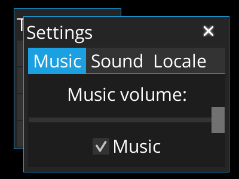

# LibGDX Autumn MVC: Simple App

A simple application built with [Autumn MVC](../../mvc) and VisUI (thanks to [gdx-lml-vis](../../lml-vis)). Nothing fancy, just some view examples - it's not an actual game, it's just supposed to make it easier to set up Autumn MVC applications.

This application will show you some basics of Autumn MVC:
- Preparing a configuration component.
- Creating UI with LML, actor injection.
- Screen transitions, dialogs.
- Music themes, using sounds, managing settings.
- Simple asset management.
- Locale changing.

Launch like any other LibGDX application. Note that it does not come packed with Gradle, so make sure to install it yourself. Also, `local.properties` file is not included: you should create it with `sdk.dir` property pointing to your Android SDK home directory. This will usually look like this (on Unixes): `sdk.dir=/home/you/Android/Sdk`.

Check it out [on-line](http://czyzby.github.io/gdx-lml/mvc).

