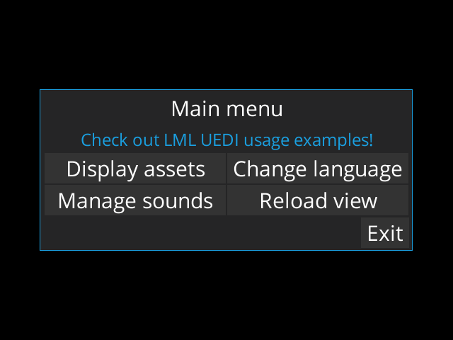

# LibGDX Markup Language with Unsettlingly Easy Dependency Injection
See [gdx-lu](../../lml-uedi).

This is an example project using LML templates to create GUI and UEDI to manage dependencies. Each example view uses different part of LU API. Note that some knowledge of [LML](../../lml) API is assumed, so make sure to go through regular LML tests first.

