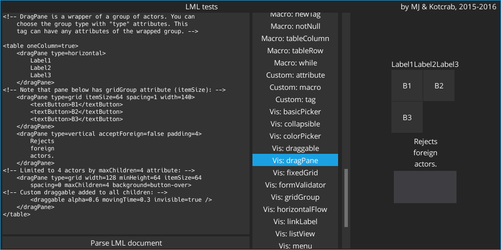

# LibGDX Markup Language with VisUI widgets
See [gdx-lml-vis](../../lml-vis).

This is an example project using LML templates to create GUI. Java part of the code explores some of the more advanced `gdx-lml` functionalities, like creating custom tags, macros and attributes. Example templates include usage of most tags and macros available in `gdx-lml-vis` by default - only GWT-incompatible features were excluded.

Check it out on-line [here](http://czyzby.github.io/gdx-lml/lml-vis) (be careful through: on-line version might be slightly outdated or use latest snapshot with new features).

