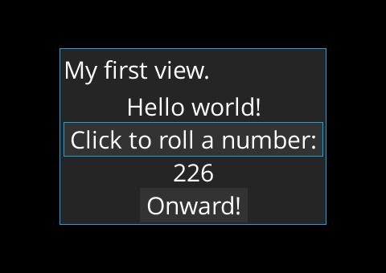

# Step-by-step tutorial

These are the sources of application created in [this tutorial](https://github.com/czyzby/gdx-lml/wiki/Your-first-LML-application). Gradle wrapper is not included. DTD schema was also omitted - its generation is left as an exercise for the user. Check it out [on-line](http://czyzby.github.io/gdx-lml/wiki).

